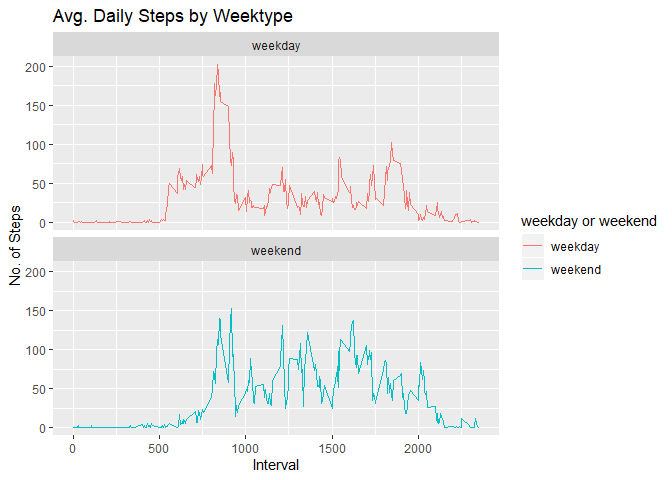

```r
library(ggplot2)
library(data.table)
```

```
## Warning: package 'data.table' was built under R version 3.6.2
```

## Download the CSV file from online URL


```r
file <- "https://d396qusza40orc.cloudfront.net/repdata%2Fdata%2Factivity.zip"
download.file(file, destfile = paste0(getwd(), '/repdata%2Fdata%2Factivity.zip'), method = "curl")
unzip("repdata%2Fdata%2Factivity.zip",exdir = "data")
```

## Now read the downloaded file in to a DataTable variable


```r
activityDT <- data.table::fread(input = "data/activity.csv")
head(activityDT)
```

```
##    steps       date interval
## 1:    NA 2012-10-01        0
## 2:    NA 2012-10-01        5
## 3:    NA 2012-10-01       10
## 4:    NA 2012-10-01       15
## 5:    NA 2012-10-01       20
## 6:    NA 2012-10-01       25
```

## Calculate total no of steps taken each day. This is calculated by taking standard deviation


```r
total_steps_pd <- activityDT[, c(lapply(.SD, sum, na.rm = FALSE)),  by = .(date), .SDcols = c("steps")]
head(total_steps_pd,10)
```

```
##           date steps
##  1: 2012-10-01    NA
##  2: 2012-10-02   126
##  3: 2012-10-03 11352
##  4: 2012-10-04 12116
##  5: 2012-10-05 13294
##  6: 2012-10-06 15420
##  7: 2012-10-07 11015
##  8: 2012-10-08    NA
##  9: 2012-10-09 12811
## 10: 2012-10-10  9900
```

## Now plot the toal_steps_pd using ggplot- histogram

```r
ggplot(total_steps_pd, aes(x = steps)) +
    geom_histogram(fill = "blue", binwidth = 200) +
    labs(title = "Daily Steps", x = "Steps", y = "Frequency")
```

```
## Warning: Removed 8 rows containing non-finite values (stat_bin).
```

<!-- -->

## Calculate mean and median of total no of steps taken each day

```r
total_steps_pd[, .(mean_steps = mean(steps, na.rm = TRUE), median_steps = median(steps, na.rm = TRUE))]
```

```
##    mean_steps median_steps
## 1:   10766.19        10765
```

## 5-minute interval that, on average, contains the maximum number of steps

```r
intervalDT <- activityDT[, c(lapply(.SD, mean, na.rm = TRUE)), .SDcols = c("steps"), by = .(interval)] 
head(intervalDT, 10)
```

```
##     interval     steps
##  1:        0 1.7169811
##  2:        5 0.3396226
##  3:       10 0.1320755
##  4:       15 0.1509434
##  5:       20 0.0754717
##  6:       25 2.0943396
##  7:       30 0.5283019
##  8:       35 0.8679245
##  9:       40 0.0000000
## 10:       45 1.4716981
```

## Plot time series plot for average number of steps taken

```r
ggplot(intervalDT, aes(x = interval , y = steps)) + geom_line(color="blue", size=1) + labs(title = "Avg. Daily Steps", x = "Interval", y = "Avg. Steps per day")
```

<!-- -->


## Imputing NA values from the dataTable


```r
# Devise a method to fill missing data
activityDT[is.na(steps), "steps"] <- activityDT[, c(lapply(.SD, median, na.rm = TRUE)), .SDcols = c("steps")]
activityDT
```

```
##        steps       date interval
##     1:     0 2012-10-01        0
##     2:     0 2012-10-01        5
##     3:     0 2012-10-01       10
##     4:     0 2012-10-01       15
##     5:     0 2012-10-01       20
##    ---                          
## 17564:     0 2012-11-30     2335
## 17565:     0 2012-11-30     2340
## 17566:     0 2012-11-30     2345
## 17567:     0 2012-11-30     2350
## 17568:     0 2012-11-30     2355
```


```r
# Now create a new data table with all the missing values filled in
data.table::fwrite(x = activityDT, file = "data/tidyData.csv", quote = FALSE)
```
### Total steps taken per day

```r
Total_Steps <- activityDT[, c(lapply(.SD, sum)), .SDcols = c("steps"), by = .(date)] 
head(Total_Steps,10)
```

```
##           date steps
##  1: 2012-10-01     0
##  2: 2012-10-02   126
##  3: 2012-10-03 11352
##  4: 2012-10-04 12116
##  5: 2012-10-05 13294
##  6: 2012-10-06 15420
##  7: 2012-10-07 11015
##  8: 2012-10-08     0
##  9: 2012-10-09 12811
## 10: 2012-10-10  9900
```

### mean and median total number of steps taken per day

```r
Total_Steps[, .(Mean_Steps = mean(steps), Median_Steps = median(steps))]
```

```
##    Mean_Steps Median_Steps
## 1:    9354.23        10395
```

### Comparison between Mean and Median with and without NA values

```r
x <- total_steps_pd[, .(TYPE = "With NAs", MEAN = mean(steps, na.rm = TRUE), MEDIAN = median(steps, na.rm = TRUE))]
y <- Total_Steps[, .(TYPE = "Without NAs", MEAN = mean(steps), MEDIAN = median(steps))]
rbind(x,y)
```

```
##           TYPE     MEAN MEDIAN
## 1:    With NAs 10766.19  10765
## 2: Without NAs  9354.23  10395
```

```{}
Important: Here you can see that mean and median has changed with and without NA values in the data set
```

## Difference between activities between weekday and weekends


```r
activityDT <- data.table::fread(input = "data/activity.csv")
activityDT[, date := as.POSIXct(date, format = "%Y-%m-%d")]
activityDT[, `Day of Week`:= weekdays(x = date)]
activityDT[grepl(pattern = "Monday|Tuesday|Wednesday|Thursday|Friday", x = `Day of Week`), "weekday or weekend"] <- "weekday"
activityDT[grepl(pattern = "Saturday|Sunday", x = `Day of Week`), "weekday or weekend"] <- "weekend"
activityDT[, `weekday or weekend` := as.factor(`weekday or weekend`)]
head(activityDT, 10)
```

```
##     steps       date interval Day of Week weekday or weekend
##  1:    NA 2012-10-01        0      Monday            weekday
##  2:    NA 2012-10-01        5      Monday            weekday
##  3:    NA 2012-10-01       10      Monday            weekday
##  4:    NA 2012-10-01       15      Monday            weekday
##  5:    NA 2012-10-01       20      Monday            weekday
##  6:    NA 2012-10-01       25      Monday            weekday
##  7:    NA 2012-10-01       30      Monday            weekday
##  8:    NA 2012-10-01       35      Monday            weekday
##  9:    NA 2012-10-01       40      Monday            weekday
## 10:    NA 2012-10-01       45      Monday            weekday
```

## Plotting for Weekend and weekdays activity patterns


```r
activityDT[is.na(steps), "steps"] <- activityDT[, c(lapply(.SD, median, na.rm = TRUE)), .SDcols = c("steps")]
IntervalDT <- activityDT[, c(lapply(.SD, mean, na.rm = TRUE)), .SDcols = c("steps"), by = .(interval, `weekday or weekend`)] 

ggplot(IntervalDT , aes(x = interval , y = steps, color=`weekday or weekend`)) + geom_line() + labs(title = "Avg. Daily Steps by Weektype", x = "Interval", y = "No. of Steps") + facet_wrap(~`weekday or weekend` , ncol = 1, nrow=2)
```

<!-- -->
